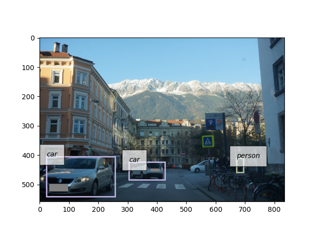
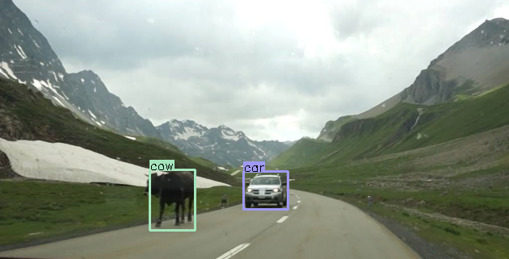

<div align="right">
  Language:
    🇺🇸
  <a title="Chinese" href="./README.zh-CN.md">🇨🇳</a>
</div>

<div align="center"><a title="" href="https://github.com/zjykzj/YOLOv3"></a></div>

<p align="center">
  «YOLOv3» reproduced the paper "YOLOv3: An Incremental Improvement"
<br>
<br>
  <a href="https://github.com/RichardLitt/standard-readme"></a>
  <a href="https://conventionalcommits.org"></a>
  <a href="http://commitizen.github.io/cz-cli/"></a>
</p>

* Train 120 rounds with [yolov3_default.cfg](./config/yolov3_default.cfg) and verify with COCO val2017. Compare with other results (training 300 rounds) as follows:

<!-- <style type="text/css">
.tg  {border-collapse:collapse;border-spacing:0;}
.tg td{border-color:black;border-style:solid;border-width:1px;font-family:Arial, sans-serif;font-size:14px;
  overflow:hidden;padding:10px 5px;word-break:normal;}
.tg th{border-color:black;border-style:solid;border-width:1px;font-family:Arial, sans-serif;font-size:14px;
  font-weight:normal;overflow:hidden;padding:10px 5px;word-break:normal;}
.tg .tg-c3ow{border-color:inherit;text-align:center;vertical-align:top}
.tg .tg-7btt{border-color:inherit;font-weight:bold;text-align:center;vertical-align:top}
</style> -->
<table class="tg">
<thead>
  <tr>
    <th class="tg-c3ow"></th>
    <th class="tg-7btt"><span style="font-style:normal">Original (darknet)</span></th>
    <th class="tg-7btt">DeNA/PyTorch_YOLOv3</th>
    <th class="tg-7btt">zjykzj/YOLOv3(This)</th>
  </tr>
</thead>
<tbody>
  <tr>
    <td class="tg-7btt">COCO AP[IoU=0.50:0.95], inference</td>
    <td class="tg-c3ow">0.310</td>
    <td class="tg-c3ow">0.311</td>
    <td class="tg-c3ow">0.315</td>
  </tr>
  <tr>
    <td class="tg-7btt">COCO AP[IoU=0.50], inference</td>
    <td class="tg-c3ow">0.553</td>
    <td class="tg-c3ow">0.558</td>
    <td class="tg-c3ow">0.543</td>
  </tr>
  <tr>
    <td class="tg-7btt">conf_thre</td>
    <td class="tg-c3ow">/</td>
    <td class="tg-c3ow">0.005</td>
    <td class="tg-c3ow">0.005</td>
  </tr>
  <tr>
    <td class="tg-7btt">nms_thre</td>
    <td class="tg-c3ow">/</td>
    <td class="tg-c3ow">0.45</td>
    <td class="tg-c3ow">0.45</td>
  </tr>
  <tr>
    <td class="tg-7btt">input_size</td>
    <td class="tg-c3ow">416</td>
    <td class="tg-c3ow">416</td>
    <td class="tg-c3ow">416</td>
  </tr>
</tbody>
</table>

## Table of Contents

- [Table of Contents](#table-of-contents)
- [Background](#background)
- [Installation](#installation)
  - [Requirements](#requirements)
  - [Container](#container)
- [Usage](#usage)
  - [Train](#train)
  - [Test](#test)
  - [Demo](#demo)
- [Maintainers](#maintainers)
- [Thanks](#thanks)
- [Contributing](#contributing)
- [License](#license)

## Background

The purpose of creating this warehouse is to better understand the YOLO series object detection network. Note: The
realization of the project depends heavily on the implementation
of [DeNA/PyTorch_YOLOv3](https://github.com/DeNA/PyTorch_YOLOv3) and [NVIDIA/apex](https://github.com/NVIDIA/apex)

## Installation

### Requirements

Refer to [requirements.txt](./requirements.txt) for installing the training environment

```shell
pip install -r requirements.txt
```

### Container

Development environment (Use nvidia docker container)

```shell
docker run --gpus all -it --rm -v </path/to/YOLOv3>:/app/YOLOv3 -v </path/to/COCO>:/app/YOLOv3/COCO nvcr.io/nvidia/pytorch:22.08-py3
```

## Usage

### Train

* One GPU

```shell
CUDA_VISIBLE_DEVICES=0 python main_amp.py -c config/yolov3_default.cfg --opt-level=O0 COCO
```

* Multi GPU

```shell
CUDA_VISIBLE_DEVICES=0,1,2,3 python -m torch.distributed.launch --nproc_per_node=4 --master_port "32111" main_amp.py -c config/yolov3_default.cfg --opt-level=O0 COCO
```

### Test

```shell
CUDA_VISIBLE_DEVICES=1 python eval.py --cfg config/yolov3_default.cfg --checkpoint outputs/yolov3_default/checkpoint_79.pth.tar COCO
```

```text
 Average Precision  (AP) @[ IoU=0.50:0.95 | area=   all | maxDets=100 ] = 0.315
 Average Precision  (AP) @[ IoU=0.50      | area=   all | maxDets=100 ] = 0.543
 Average Precision  (AP) @[ IoU=0.75      | area=   all | maxDets=100 ] = 0.327
 Average Precision  (AP) @[ IoU=0.50:0.95 | area= small | maxDets=100 ] = 0.132
 Average Precision  (AP) @[ IoU=0.50:0.95 | area=medium | maxDets=100 ] = 0.344
 Average Precision  (AP) @[ IoU=0.50:0.95 | area= large | maxDets=100 ] = 0.470
 Average Recall     (AR) @[ IoU=0.50:0.95 | area=   all | maxDets=  1 ] = 0.271
 Average Recall     (AR) @[ IoU=0.50:0.95 | area=   all | maxDets= 10 ] = 0.415
 Average Recall     (AR) @[ IoU=0.50:0.95 | area=   all | maxDets=100 ] = 0.439
 Average Recall     (AR) @[ IoU=0.50:0.95 | area= small | maxDets=100 ] = 0.239
 Average Recall     (AR) @[ IoU=0.50:0.95 | area=medium | maxDets=100 ] = 0.473
 Average Recall     (AR) @[ IoU=0.50:0.95 | area= large | maxDets=100 ] = 0.597
```

### Demo

```shell
python demo.py --cfg config/yolov3_default.cfg --ckpt outputs/yolov3_default/checkpoint_79.pth.tar --image data/mountain.png --conf-thresh 0.5 --nms-thresh 0.45
python demo.py --cfg config/yolov3_default.cfg --ckpt outputs/yolov3_default/checkpoint_79.pth.tar --image data/innsbruck.png --conf-thresh 0.5 --nms-thresh 0.45
```

<p align="left">  </p>

## Maintainers

* zhujian - *Initial work* - [zjykzj](https://github.com/zjykzj)

## Thanks

* [DeNA/PyTorch_YOLOv3](https://github.com/DeNA/PyTorch_YOLOv3)
* [NVIDIA/apex](https://github.com/NVIDIA/apex)
* [ZJCV/ZCls2](https://github.com/ZJCV/ZCls2)
* [ultralytics/yolov5](https://github.com/ultralytics/yolov5)

## Contributing

Anyone's participation is welcome! Open an [issue](https://github.com/zjykzj/YOLOv3/issues) or submit PRs.

Small note:

* Git submission specifications should be complied
  with [Conventional Commits](https://www.conventionalcommits.org/en/v1.0.0-beta.4/)
* If versioned, please conform to the [Semantic Versioning 2.0.0](https://semver.org) specification
* If editing the README, please conform to the [standard-readme](https://github.com/RichardLitt/standard-readme)
  specification.

## License

[Apache License 2.0](LICENSE) © 2022 zjykzj