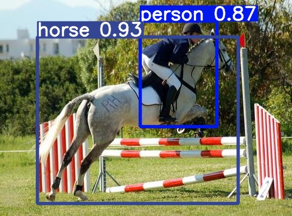

<div align="right">
  Language:
    🇺🇸
  <a title="Chinese" href="./README.zh-CN.md">🇨🇳</a>
</div>

<div align="center"><a title="" href="https://github.com/zjykzj/YOLOv3"></a></div>

<p align="center">
  «YOLOv3» reproduced the paper "YOLOv3: An Incremental Improvement"
<br>
<br>
  <a href="https://github.com/RichardLitt/standard-readme"></a>
  <a href="https://conventionalcommits.org"></a>
  <a href="http://commitizen.github.io/cz-cli/"></a>
</p>

* Train using the `COCO train2017` dataset and test using the `COCO val2017` dataset with an input size of `416x416`. give the result as follows (*No version of the COCO dataset used in the paper was found*)

<!-- <style type="text/css">
.tg  {border-collapse:collapse;border-spacing:0;}
.tg td{border-color:black;border-style:solid;border-width:1px;font-family:Arial, sans-serif;font-size:14px;
  overflow:hidden;padding:10px 5px;word-break:normal;}
.tg th{border-color:black;border-style:solid;border-width:1px;font-family:Arial, sans-serif;font-size:14px;
  font-weight:normal;overflow:hidden;padding:10px 5px;word-break:normal;}
.tg .tg-zkss{background-color:#FFF;border-color:inherit;color:#333;text-align:center;vertical-align:top}
.tg .tg-baqh{text-align:center;vertical-align:top}
.tg .tg-fr9f{background-color:#FFF;border-color:inherit;color:#333;font-weight:bold;text-align:center;vertical-align:top}
.tg .tg-y5w1{background-color:#FFF;border-color:inherit;color:#00E;font-weight:bold;text-align:center;vertical-align:top}
.tg .tg-9y4h{background-color:#FFF;border-color:inherit;color:#1F2328;text-align:center;vertical-align:middle}
</style> -->
<table class="tg">
<thead>
  <tr>
    <th class="tg-fr9f"></th>
    <th class="tg-fr9f"><span style="font-style:normal">Original (darknet)</span></th>
    <th class="tg-y5w1">DeNA/PyTorch_YOLOv3</th>
    <th class="tg-y5w1"><span style="font-weight:700;font-style:normal">zjykzj/YOLOv3(This)</span></th>
  </tr>
</thead>
<tbody>
  <tr>
    <td class="tg-fr9f">ARCH</td>
    <td class="tg-zkss">YOLOv3</td>
    <td class="tg-zkss">YOLOv3</td>
    <td class="tg-zkss">YOLOv3</td>
  </tr>
  <tr>
    <td class="tg-fr9f">COCO AP[IoU=0.50:0.95]</td>
    <td class="tg-zkss">0.310</td>
    <td class="tg-9y4h">0.311</td>
    <td class="tg-9y4h">0.370</td>
  </tr>
  <tr>
    <td class="tg-baqh">COCO AP[IoU=0.50]</td>
    <td class="tg-baqh">0.553</td>
    <td class="tg-baqh">0.558</td>
    <td class="tg-baqh">0.604</td>
  </tr>
</tbody>
</table>

## Table of Contents

- [Table of Contents](#table-of-contents)
- [Latest News](#latest-news)
- [Background](#background)
- [Installation](#installation)
- [Usage](#usage)
  - [Train](#train)
  - [Eval](#eval)
  - [Predict](#predict)
- [Maintainers](#maintainers)
- [Thanks](#thanks)
- [Contributing](#contributing)
- [License](#license)

## Latest News

* ***[2024/05/09][v5.0](https://github.com/zjykzj/YOLOv3/releases/tag/v5.0). Refactoring YOLOv3 project, integrating yolov5 v7.0, reimplementing YOLOv3/YOLOv3-fast and YOLOv3Loss.***
* ***[2023/07/19][v4.0](https://github.com/zjykzj/YOLOv3/releases/tag/v4.0). Add [ultralytics/yolov5](https://github.com/ultralytics/yolov5)([485da42](https://github.com/ultralytics/yolov5/commit/485da42273839d20ea6bdaf142fd02c1027aba61)) transforms and support AMP training.***
* ***[2023/06/22][v3.2](https://github.com/zjykzj/YOLOv3/releases/tag/v3.2). Remove Excess Code and Implementation.***
* ***[2023/06/22][v3.1](https://github.com/zjykzj/YOLOv3/releases/tag/v3.1). Reconstruct DATA Module and Preprocessing Module.***
* ***[2023/05/24][v3.0](https://github.com/zjykzj/YOLOv3/releases/tag/v3.0). Refer to [zjykzj/YOLOv2](https://github.com/zjykzj/YOLOv2) to reconstruct the entire project and train `Pascal VOC` and `COCO` datasets with `YOLOv2Loss`.***
* ***[2023/04/16][v2.0](https://github.com/zjykzj/YOLOv3/releases/tag/v2.0). Fixed preprocessing implementation, YOLOv3 network performance close to the original paper implementation.***
* ***[2023/02/16][v1.0](https://github.com/zjykzj/YOLOv3/releases/tag/v1.0). implementing preliminary YOLOv3 network training and inference implementation.***

## Background

The purpose of creating this warehouse is to better understand the YOLO series object detection network. Note: The realization of the project depends heavily on the implementation
of [DeNA/PyTorch_YOLOv3](https://github.com/DeNA/PyTorch_YOLOv3) and [NVIDIA/apex](https://github.com/NVIDIA/apex)

Note: the latest implementation of YOLOv3 in our warehouse is entirely based on [ultralytics/yolov5 v7.0](https://github.com/ultralytics/yolov5/releases/tag/v7.0)

## Installation

```shell
pip3 install -r requirements.txt
```

Or use docker container

```shell
docker run -it --runtime nvidia --gpus=all --shm-size=16g -v /etc/localtime:/etc/localtime -v $(pwd):/workdir --workdir=/workdir --name yolov2 ultralytics/yolov5:latest
```

## Usage

### Train

```shell
python3 train.py --data VOC.yaml --weights "" --cfg yolov3_voc.yaml --img 640 --device 0 --yolov3loss
python3 train.py --data VOC.yaml --weights "" --cfg yolov3-fast_voc.yaml --img 640 --device 0 --yolov3loss
python3 train.py --data coco.yaml --weights "" --cfg yolov3_coco.yaml --img 640 --device 0 --yolov3loss
python3 train.py --data coco.yaml --weights "" --cfg yolov3-fast_coco.yaml --img 640 --device 0 --yolov3loss
```

### Eval

```shell
# python3 val.py --weights runs/yolov3_voc.pt --data VOC.yaml --device 0
yolov3_voc summary: 198 layers, 67238145 parameters, 0 gradients, 151.5 GFLOPs
                 Class     Images  Instances          P          R      mAP50   mAP50-95: 100%|██████████| 155/155 01:04
                   all       4952      12032      0.811      0.742      0.816      0.568
             aeroplane       4952        285      0.938      0.791      0.897      0.607
Speed: 0.1ms pre-process, 6.8ms inference, 1.6ms NMS per image at shape (32, 3, 640, 640)
# python3 val.py --weights runs/yolov3-fast.pt --data VOC.yaml --device 0
yolov3-fast_voc summary: 108 layers, 39945921 parameters, 0 gradients, 76.0 GFLOPs
                 Class     Images  Instances          P          R      mAP50   mAP50-95: 100%|██████████| 155/155 00:52
                   all       4952      12032      0.734      0.704      0.745       0.45
             aeroplane       4952        285      0.759      0.747      0.796      0.427
Speed: 0.1ms pre-process, 4.3ms inference, 1.6ms NMS per image at shape (32, 3, 640, 640)
# python3 val.py --weights runs/yolov3_coco.pt --data coco.yaml --device 0
yolov3_coco summary: 198 layers, 67561245 parameters, 0 gradients, 152.5 GFLOPs
Speed: 0.1ms pre-process, 6.9ms inference, 2.1ms NMS per image at shape (32, 3, 640, 640)
 Average Precision  (AP) @[ IoU=0.50:0.95 | area=   all | maxDets=100 ] = 0.400
 Average Precision  (AP) @[ IoU=0.50      | area=   all | maxDets=100 ] = 0.620
# python3 val.py --weights runs/yolov3-fast_coco.pt --data coco.yaml --device 0
yolov3-fast_coco summary: 108 layers, 40269021 parameters, 0 gradients, 77.0 GFLOPs
Speed: 0.1ms pre-process, 4.4ms inference, 2.2ms NMS per image at shape (32, 3, 640, 640)
 Average Precision  (AP) @[ IoU=0.50:0.95 | area=   all | maxDets=100 ] = 0.329
 Average Precision  (AP) @[ IoU=0.50      | area=   all | maxDets=100 ] = 0.560
```

### Predict

```shell
python3 detect.py --weights runs/yolov3_voc.pt --source ./assets/voc2007-test/
```

<p align="left">  </p>

```shell
python3 detect.py --weights runs/yolov3_coco.pt --source ./assets/coco/
```

<p align="left">  </p>

## Maintainers

* zhujian - *Initial work* - [zjykzj](https://github.com/zjykzj)

## Thanks

* [DeNA/PyTorch_YOLOv3](https://github.com/DeNA/PyTorch_YOLOv3)
* [NVIDIA/apex](https://github.com/NVIDIA/apex)
* [ZJCV/ZCls2](https://github.com/ZJCV/ZCls2)
* [ultralytics/yolov5](https://github.com/ultralytics/yolov5)
* [zjykzj/YOLOv2](https://github.com/zjykzj/YOLOv2)

## Contributing

Anyone's participation is welcome! Open an [issue](https://github.com/zjykzj/YOLOv3/issues) or submit PRs.

Small note:

* Git submission specifications should be complied
  with [Conventional Commits](https://www.conventionalcommits.org/en/v1.0.0-beta.4/)
* If versioned, please conform to the [Semantic Versioning 2.0.0](https://semver.org) specification
* If editing the README, please conform to the [standard-readme](https://github.com/RichardLitt/standard-readme)
  specification.

## License

[Apache License 2.0](LICENSE) © 2022 zjykzj