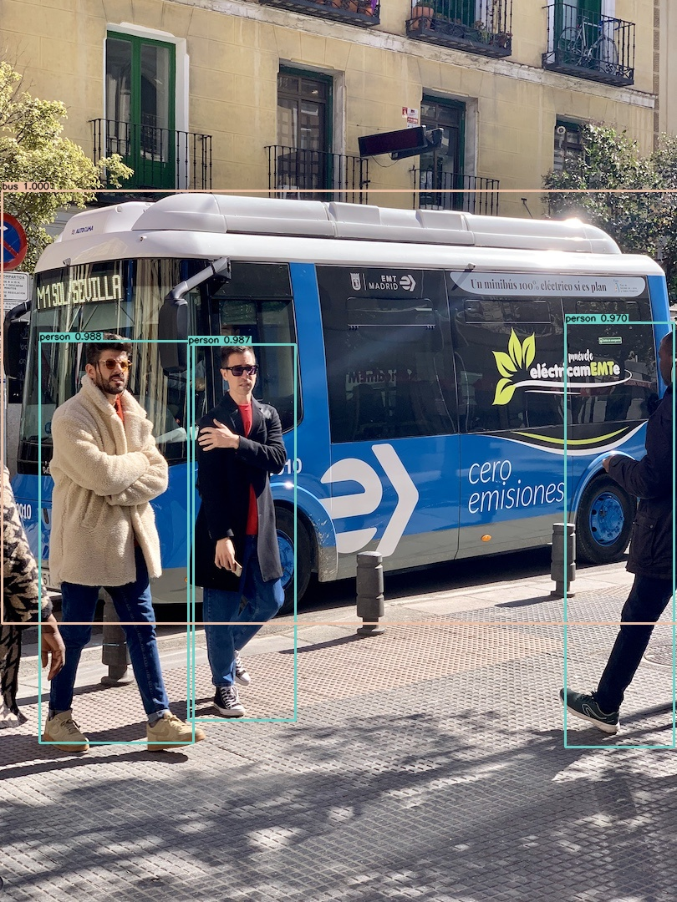
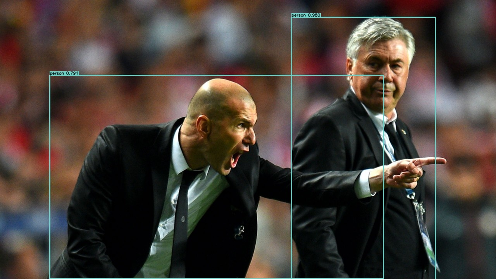

<div align="right">
  Language:
    🇺🇸
  <a title="Chinese" href="./README.zh-CN.md">🇨🇳</a>
</div>

<div align="center"><a title="" href="https://github.com/zjykzj/YOLOv3"></a></div>

<p align="center">
  «YOLOv3» reproduced the paper "YOLOv3: An Incremental Improvement"
<br>
<br>
  <a href="https://github.com/RichardLitt/standard-readme"></a>
  <a href="https://conventionalcommits.org"></a>
  <a href="http://commitizen.github.io/cz-cli/"></a>
</p>

* Train using the `COCO train2017` dataset and test using the `COCO val2017` dataset with an input size of `416x416`. give the result as follows (*No version of the COCO dataset used in the paper was found*)

<!-- <style type="text/css">
.tg  {border-collapse:collapse;border-spacing:0;}
.tg td{border-color:black;border-style:solid;border-width:1px;font-family:Arial, sans-serif;font-size:14px;
  overflow:hidden;padding:10px 5px;word-break:normal;}
.tg th{border-color:black;border-style:solid;border-width:1px;font-family:Arial, sans-serif;font-size:14px;
  font-weight:normal;overflow:hidden;padding:10px 5px;word-break:normal;}
.tg .tg-zkss{background-color:#FFF;border-color:inherit;color:#333;text-align:center;vertical-align:top}
.tg .tg-baqh{text-align:center;vertical-align:top}
.tg .tg-fr9f{background-color:#FFF;border-color:inherit;color:#333;font-weight:bold;text-align:center;vertical-align:top}
.tg .tg-y5w1{background-color:#FFF;border-color:inherit;color:#00E;font-weight:bold;text-align:center;vertical-align:top}
.tg .tg-9y4h{background-color:#FFF;border-color:inherit;color:#1F2328;text-align:center;vertical-align:middle}
</style> -->
<table class="tg">
<thead>
  <tr>
    <th class="tg-fr9f"></th>
    <th class="tg-fr9f"><span style="font-style:normal">Original (darknet)</span></th>
    <th class="tg-y5w1">DeNA/PyTorch_YOLOv3</th>
    <th class="tg-y5w1"><span style="font-weight:700;font-style:normal">zjykzj/YOLOv3(This)</span></th>
  </tr>
</thead>
<tbody>
  <tr>
    <td class="tg-fr9f">ARCH</td>
    <td class="tg-zkss">YOLOv3</td>
    <td class="tg-zkss">YOLOv3</td>
    <td class="tg-zkss">YOLOv3</td>
  </tr>
  <tr>
    <td class="tg-fr9f">COCO AP[IoU=0.50:0.95]</td>
    <td class="tg-zkss">0.310</td>
    <td class="tg-9y4h">0.311</td>
    <td class="tg-9y4h">0.314(<a href="https://github.com/zjykzj/YOLOv3/releases/tag/v4.0">v4.0</a>)/0.315(<a href="https://github.com/zjykzj/YOLOv3/releases/tag/v2.0">v2.0</a>)</td>
  </tr>
  <tr>
    <td class="tg-baqh">COCO AP[IoU=0.50]</td>
    <td class="tg-baqh">0.553</td>
    <td class="tg-baqh">0.558</td>
    <td class="tg-baqh">0.535(<a href="https://github.com/zjykzj/YOLOv3/releases/tag/v4.0">v4.0</a>)/0.543(<a href="https://github.com/zjykzj/YOLOv3/releases/tag/v2.0">v2.0</a>)</td>
  </tr>
</tbody>
</table>

## Table of Contents

- [Table of Contents](#table-of-contents)
- [Latest News](#latest-news)
- [Background](#background)
- [Prepare Data](#prepare-data)
  - [Pascal VOC](#pascal-voc)
  - [COCO](#coco)
- [Installation](#installation)
  - [Requirements](#requirements)
  - [Container](#container)
- [Usage](#usage)
  - [Train](#train)
  - [Eval](#eval)
  - [Demo](#demo)
- [Maintainers](#maintainers)
- [Thanks](#thanks)
- [Contributing](#contributing)
- [License](#license)

## Latest News

* ***[2023/07/19][v4.0](https://github.com/zjykzj/YOLOv3/releases/tag/v4.0). Add [ultralytics/yolov5](https://github.com/ultralytics/yolov5)([485da42](https://github.com/ultralytics/yolov5/commit/485da42273839d20ea6bdaf142fd02c1027aba61)) transforms and support AMP training.***
* ***[2023/06/22][v3.2](https://github.com/zjykzj/YOLOv3/releases/tag/v3.2). Remove Excess Code and Implementation.***
* ***[2023/06/22][v3.1](https://github.com/zjykzj/YOLOv3/releases/tag/v3.1). Reconstruct DATA Module and Preprocessing Module.***
* ***[2023/05/24][v3.0](https://github.com/zjykzj/YOLOv3/releases/tag/v3.0). Refer to [zjykzj/YOLOv2](https://github.com/zjykzj/YOLOv2) to reconstruct the entire project and train `Pascal VOC` and `COCO` datasets with `YOLOv2Loss`.***
* ***[2023/04/16][v2.0](https://github.com/zjykzj/YOLOv3/releases/tag/v2.0). Fixed preprocessing implementation, YOLOv3 network performance close to the original paper implementation.***
* ***[2023/02/16][v1.0](https://github.com/zjykzj/YOLOv3/releases/tag/v1.0). implementing preliminary YOLOv3 network training and inference implementation.***

## Background

The purpose of creating this warehouse is to better understand the YOLO series object detection network. Note: The realization of the project depends heavily on the implementation
of [DeNA/PyTorch_YOLOv3](https://github.com/DeNA/PyTorch_YOLOv3) and [NVIDIA/apex](https://github.com/NVIDIA/apex)

## Prepare Data

### Pascal VOC

Use this script [voc2yolov5.py](https://github.com/zjykzj/vocdev/blob/master/py/voc2yolov5.py)

```shell
python voc2yolov5.py -s /home/zj/data/voc -d /home/zj/data/voc/voc2yolov5-train -l trainval-2007 trainval-2012
python voc2yolov5.py -s /home/zj/data/voc -d /home/zj/data/voc/voc2yolov5-val -l test-2007
```

Then softlink the folder where the dataset is located to the specified location:

```shell
ln -s /path/to/voc /path/to/YOLOv3/../datasets/voc
```

### COCO

Use this script [get_coco.sh](https://github.com/ultralytics/yolov5/blob/master/data/scripts/get_coco.sh)


## Installation

### Requirements

Refer to [requirements.txt](./requirements.txt) for installing the training environment

```shell
pip install -r requirements.txt
```

### Container

Development environment (Use nvidia docker container)

```shell
docker run --gpus all -it --rm -v </path/to/YOLOv3>:/app/YOLOv3 -v </path/to/COCO>:/app/YOLOv3/COCO nvcr.io/nvidia/pytorch:22.08-py3
```

## Usage

### Train

* One GPU

```shell
CUDA_VISIBLE_DEVICES=0 python main_amp.py -c configs/yolov3_coco.cfg --opt-level=O1 ../datasets/coco
```

* Multi-GPUs

```shell
CUDA_VISIBLE_DEVICES=0,1,2,3 python -m torch.distributed.launch --nproc_per_node=4 --master_port "36321" main_amp.py -c configs/yolov3_coco.cfg --opt-level=O1 ../datasets/coco
```

### Eval

```shell
python eval.py -c configs/yolov3_coco.cfg -ckpt outputs/yolov3_coco/model_best.pth.tar ../datasets/coco
 Average Precision  (AP) @[ IoU=0.50:0.95 | area=   all | maxDets=100 ] = 0.314
 Average Precision  (AP) @[ IoU=0.50      | area=   all | maxDets=100 ] = 0.535
 Average Precision  (AP) @[ IoU=0.75      | area=   all | maxDets=100 ] = 0.323
 Average Precision  (AP) @[ IoU=0.50:0.95 | area= small | maxDets=100 ] = 0.133
 Average Precision  (AP) @[ IoU=0.50:0.95 | area=medium | maxDets=100 ] = 0.342
 Average Precision  (AP) @[ IoU=0.50:0.95 | area= large | maxDets=100 ] = 0.467
 Average Recall     (AR) @[ IoU=0.50:0.95 | area=   all | maxDets=  1 ] = 0.272
 Average Recall     (AR) @[ IoU=0.50:0.95 | area=   all | maxDets= 10 ] = 0.413
 Average Recall     (AR) @[ IoU=0.50:0.95 | area=   all | maxDets=100 ] = 0.436
 Average Recall     (AR) @[ IoU=0.50:0.95 | area= small | maxDets=100 ] = 0.252
 Average Recall     (AR) @[ IoU=0.50:0.95 | area=medium | maxDets=100 ] = 0.473
 Average Recall     (AR) @[ IoU=0.50:0.95 | area= large | maxDets=100 ] = 0.594
python eval.py -c configs/yolov3_voc.cfg -ckpt outputs/yolov3_voc/model_best.pth.tar ../datasets/voc
VOC07 metric? Yes
AP for aeroplane = 0.8442
AP for bicycle = 0.8575
AP for bird = 0.7730
AP for boat = 0.6824
AP for bottle = 0.6737
AP for bus = 0.8505
AP for car = 0.8663
AP for cat = 0.8667
AP for chair = 0.6073
AP for cow = 0.8196
AP for diningtable = 0.7213
AP for dog = 0.8433
AP for horse = 0.8761
AP for motorbike = 0.8568
AP for person = 0.8245
AP for pottedplant = 0.5211
AP for sheep = 0.8140
AP for sofa = 0.7385
AP for train = 0.8304
AP for tvmonitor = 0.7727
Mean AP = 0.7820
```

### Demo

```shell
python demo.py -c 0.6 configs/yolov3_coco.cfg outputs/yolov3_coco/model_best.pth.tar --exp coco assets/coco/
```

<p align="left">  </p>

```shell
python demo.py -c 0.6 configs/yolov3_voc.cfg outputs/yolov3_voc/model_best.pth.tar --exp voc assets/voc2007-test/
```

<p align="left">  </p>

## Maintainers

* zhujian - *Initial work* - [zjykzj](https://github.com/zjykzj)

## Thanks

* [DeNA/PyTorch_YOLOv3](https://github.com/DeNA/PyTorch_YOLOv3)
* [NVIDIA/apex](https://github.com/NVIDIA/apex)
* [ZJCV/ZCls2](https://github.com/ZJCV/ZCls2)
* [ultralytics/yolov5](https://github.com/ultralytics/yolov5)
* [zjykzj/YOLOv2](https://github.com/zjykzj/YOLOv2)

## Contributing

Anyone's participation is welcome! Open an [issue](https://github.com/zjykzj/YOLOv3/issues) or submit PRs.

Small note:

* Git submission specifications should be complied
  with [Conventional Commits](https://www.conventionalcommits.org/en/v1.0.0-beta.4/)
* If versioned, please conform to the [Semantic Versioning 2.0.0](https://semver.org) specification
* If editing the README, please conform to the [standard-readme](https://github.com/RichardLitt/standard-readme)
  specification.

## License

[Apache License 2.0](LICENSE) © 2022 zjykzj