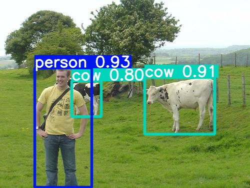
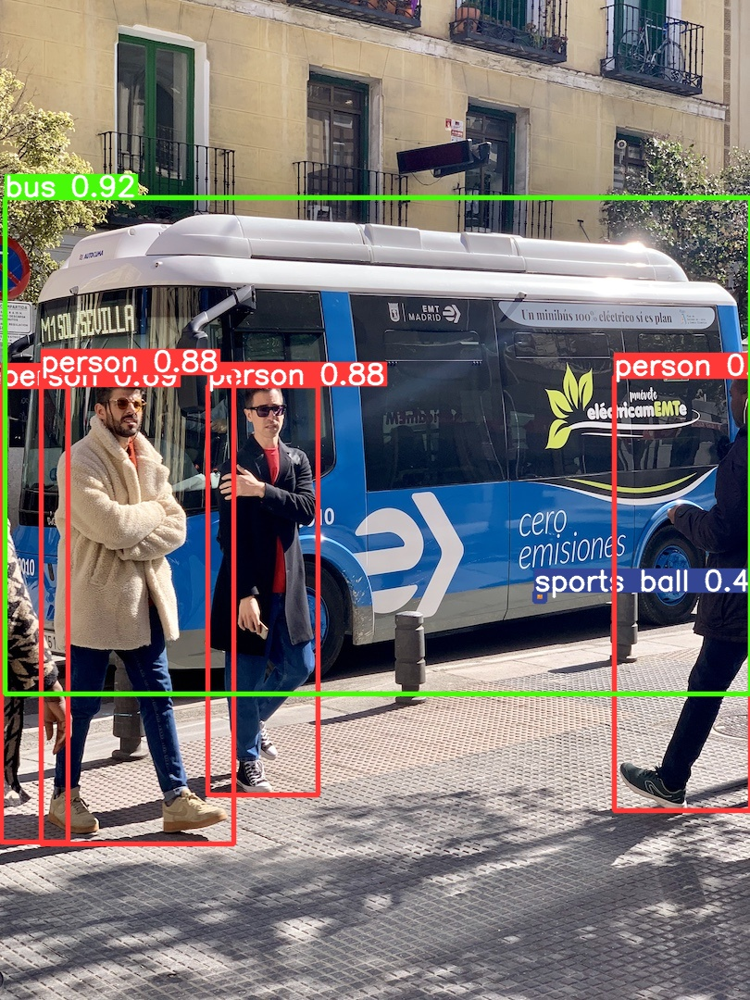
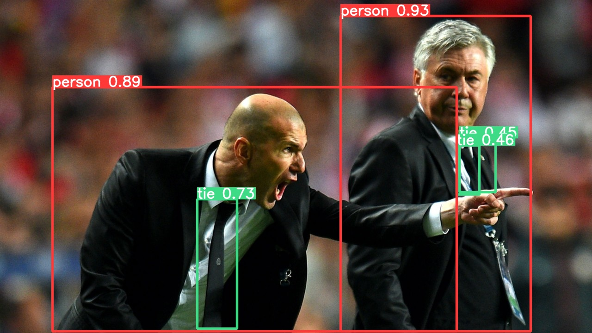

<div align="right">
  语言:
    🇨🇳
  <a title="英语" href="./README.md">🇺🇸</a>
</div>

<div align="center"><a title="" href="https://github.com/zjykzj/YOLOv3"></a></div>

<p align="center">
  «YOLOv3» 复现了论文 "YOLOv3: An Incremental Improvement"
<br>
<br>
  <a href="https://github.com/RichardLitt/standard-readme"></a>
  <a href="https://conventionalcommits.org"></a>
  <a href="http://commitizen.github.io/cz-cli/"></a>
</p>

* 使用`VOC07+12 trainval`数据集进行训练，使用`VOC2007 Test`进行测试，输入大小为`416x416`。测试结果如下：

<!-- <style type="text/css">
.tg  {border-collapse:collapse;border-spacing:0;}
.tg td{border-color:black;border-style:solid;border-width:1px;font-family:Arial, sans-serif;font-size:14px;
  overflow:hidden;padding:10px 5px;word-break:normal;}
.tg th{border-color:black;border-style:solid;border-width:1px;font-family:Arial, sans-serif;font-size:14px;
  font-weight:normal;overflow:hidden;padding:10px 5px;word-break:normal;}
.tg .tg-zkss{background-color:#FFF;border-color:inherit;color:#333;text-align:center;vertical-align:top}
.tg .tg-baqh{text-align:center;vertical-align:top}
.tg .tg-fr9f{background-color:#FFF;border-color:inherit;color:#333;font-weight:bold;text-align:center;vertical-align:top}
.tg .tg-y5w1{background-color:#FFF;border-color:inherit;color:#00E;font-weight:bold;text-align:center;vertical-align:top}
.tg .tg-9y4h{background-color:#FFF;border-color:inherit;color:#1F2328;text-align:center;vertical-align:middle}
</style> -->
<table class="tg">
<thead>
  <tr>
    <th class="tg-fr9f"></th>
    <th class="tg-fr9f"><span style="font-style:normal">Original (darknet)</span></th>
    <th class="tg-y5w1">DeNA/PyTorch_YOLOv3</th>
    <th class="tg-y5w1"><span style="font-weight:700;font-style:normal">zjykzj/YOLOv3(This)</span></th>
  </tr>
</thead>
<tbody>
  <tr>
    <td class="tg-fr9f">ARCH</td>
    <td class="tg-zkss">YOLOv3</td>
    <td class="tg-zkss">YOLOv3</td>
    <td class="tg-zkss">YOLOv3</td>
  </tr>
  <tr>
    <td class="tg-fr9f">COCO AP[IoU=0.50:0.95]</td>
    <td class="tg-zkss">0.310</td>
    <td class="tg-9y4h">0.311</td>
    <td class="tg-9y4h">0.400</td>
  </tr>
  <tr>
    <td class="tg-baqh">COCO AP[IoU=0.50]</td>
    <td class="tg-baqh">0.553</td>
    <td class="tg-baqh">0.558</td>
    <td class="tg-baqh">0.620</td>
  </tr>
</tbody>
</table>

## 内容列表

- [内容列表](#内容列表)
- [最近新闻](#最近新闻)
- [背景](#背景)
- [安装](#安装)
- [用法](#用法)
  - [训练](#训练)
  - [评估](#评估)
  - [预测](#预测)
- [主要维护人员](#主要维护人员)
- [致谢](#致谢)
- [参与贡献方式](#参与贡献方式)
- [许可证](#许可证)

## 最近新闻

* ***[2024/05/19][v5.1](https://github.com/zjykzj/YOLOv3/releases/tag/v5.1). 优化YOLOv3Loss，使用BCELoss替代MSELoss进行置信度损失计算。***
* ***[2024/05/09][v5.0](https://github.com/zjykzj/YOLOv3/releases/tag/v5.0). 重构YOLOv3工程，集成yolov5-v7.0，重新实现YOLOv3/YOLOv3-fast以及YOLOv3Loss。***
* ***[2023/07/19][v4.0](https://github.com/zjykzj/YOLOv3/releases/tag/v4.0). 添加[ultralytics/yolov5](https://github.com/ultralytics/yolov5)([485da42](https://github.com/ultralytics/yolov5/commit/485da42273839d20ea6bdaf142fd02c1027aba61)) 预处理实现以及支持AMP训练。***
* ***[2023/06/22][v3.2](https://github.com/zjykzj/YOLOv3/releases/tag/v3.2). 移除多余的代码和实现。***
* ***[2023/06/22][v3.1](https://github.com/zjykzj/YOLOv3/releases/tag/v3.1). 重构数据模块和预处理模块。***
* ***[2023/05/24][v3.0](https://github.com/zjykzj/YOLOv3/releases/tag/v3.0). 参考[zjykzj/YOLOv2](https://github.com/zjykzj/YOLOv2)重构整个工程，同时使用`YOLOv2Loss`训练`Pascal VOC`和`COCO`数据集。***
* ***[2023/04/16][v2.0](https://github.com/zjykzj/YOLOv3/releases/tag/v2.0). 修复预处理实现，现在YOLOv3的训练性能已经接近于原始论文实现。***
* ***[2023/02/16][v1.0](https://github.com/zjykzj/YOLOv3/releases/tag/v1.0). 初步实现YOLOv3网络训练和推理实现。***

## 背景

创建此仓库的目的是为了更好地理解YOLO系列目标检测网络。注意：该项目的实现参考了[DeNA/PyTorch_YOLOv3](https://github.com/DeNA/PyTorch_YOLOv3)和[NVIDIA/apex](https://github.com/NVIDIA/apex)

注意：当前本仓库最新的实现完全基于[ultralytics/yolov5 v7.0](https://github.com/ultralytics/yolov5/releases/tag/v7.0)

## 安装

```shell
pip3 install -r requirements.txt
```

或者使用Docker Container

```shell
docker run -it --runtime nvidia --gpus=all --shm-size=16g -v /etc/localtime:/etc/localtime -v $(pwd):/workdir --workdir=/workdir --name yolov3 ultralytics/yolov5:v7.0
```

## 用法

### 训练

```shell
python3 train.py --data VOC.yaml --weights "" --cfg yolov3_voc.yaml --img 640 --device 0 --yolov3loss
python3 train.py --data VOC.yaml --weights "" --cfg yolov3-fast_voc.yaml --img 640 --device 0 --yolov3loss
python3 train.py --data coco.yaml --weights "" --cfg yolov3_coco.yaml --img 640 --device 0 --yolov3loss
python3 train.py --data coco.yaml --weights "" --cfg yolov3-fast_coco.yaml --img 640 --device 0 --yolov3loss
```

### 评估

```shell
# python3 val.py --weights runs/yolov3_voc.pt --data VOC.yaml --device 0
yolov3_voc summary: 198 layers, 67238145 parameters, 0 gradients, 151.5 GFLOPs
                 Class     Images  Instances          P          R      mAP50   mAP50-95: 100%|██████████| 155/155 01:04
                   all       4952      12032      0.811      0.742      0.816      0.568
             aeroplane       4952        285      0.938      0.791      0.897      0.607
Speed: 0.1ms pre-process, 6.8ms inference, 1.6ms NMS per image at shape (32, 3, 640, 640)
# python3 val.py --weights runs/yolov3-fast_voc.pt --data VOC.yaml --device 0
yolov3-fast_voc summary: 108 layers, 39945921 parameters, 0 gradients, 76.0 GFLOPs
                 Class     Images  Instances          P          R      mAP50   mAP50-95: 100%|██████████| 155/155 00:52
                   all       4952      12032      0.734      0.704      0.745       0.45
             aeroplane       4952        285      0.759      0.747      0.796      0.427
Speed: 0.1ms pre-process, 4.3ms inference, 1.6ms NMS per image at shape (32, 3, 640, 640)
# python3 val.py --weights runs/yolov3_coco.pt --data coco.yaml --device 0
yolov3_coco summary: 198 layers, 67561245 parameters, 0 gradients, 152.5 GFLOPs
Speed: 0.1ms pre-process, 6.9ms inference, 2.1ms NMS per image at shape (32, 3, 640, 640)
 Average Precision  (AP) @[ IoU=0.50:0.95 | area=   all | maxDets=100 ] = 0.400
 Average Precision  (AP) @[ IoU=0.50      | area=   all | maxDets=100 ] = 0.620
# python3 val.py --weights runs/yolov3-fast_coco.pt --data coco.yaml --device 0
yolov3-fast_coco summary: 108 layers, 40269021 parameters, 0 gradients, 77.0 GFLOPs
Speed: 0.1ms pre-process, 4.4ms inference, 2.2ms NMS per image at shape (32, 3, 640, 640)
 Average Precision  (AP) @[ IoU=0.50:0.95 | area=   all | maxDets=100 ] = 0.329
 Average Precision  (AP) @[ IoU=0.50      | area=   all | maxDets=100 ] = 0.560
```

### 预测

```shell
python3 detect.py --weights runs/yolov3_voc.pt --source ./assets/voc2007-test/
```

<p align="left">  </p>

```shell
python3 detect.py --weights runs/yolov3_coco.pt --source ./assets/coco/
```

<p align="left">  </p>

## 主要维护人员

* zhujian - *Initial work* - [zjykzj](https://github.com/zjykzj)

## 致谢

* [DeNA/PyTorch_YOLOv3](https://github.com/DeNA/PyTorch_YOLOv3)
* [NVIDIA/apex](https://github.com/NVIDIA/apex)
* [ZJCV/ZCls2](https://github.com/ZJCV/ZCls2)
* [ultralytics/yolov5](https://github.com/ultralytics/yolov5)
* [zjykzj/YOLOv2](https://github.com/zjykzj/YOLOv2)

## 参与贡献方式

欢迎任何人的参与！打开[issue](https://github.com/zjykzj/YOLOv3/issues)或提交合并请求。

注意:

* `GIT`提交，请遵守[Conventional Commits](https://www.conventionalcommits.org/en/v1.0.0-beta.4/)规范
* 语义版本化，请遵守[Semantic Versioning 2.0.0](https://semver.org)规范
* `README`编写，请遵守[standard-readme](https://github.com/RichardLitt/standard-readme)规范

## 许可证

[Apache License 2.0](LICENSE) © 2023 zjykzj